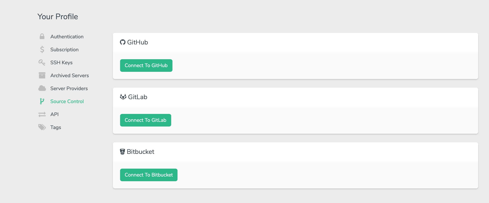
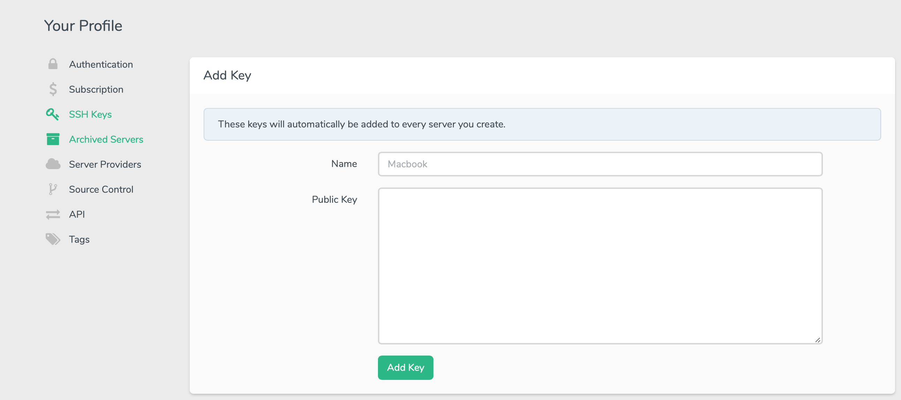
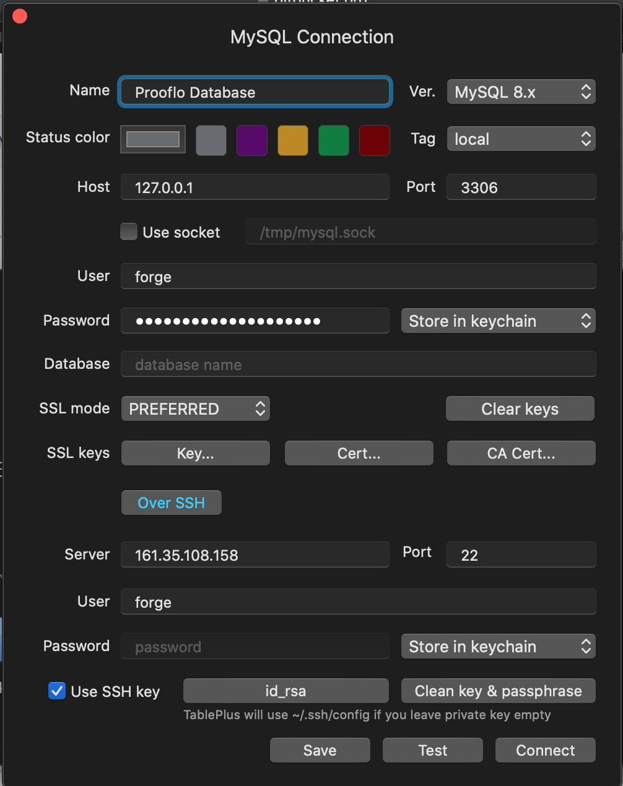

# Prooflo Docs #

Prooflo how to setup server and clone project from github.

### Local Installation ###

1. Clone the project:
	you have to download you project or copy project url and wire it in you command line like `git clone git@bitbucket.org:username/project-name.git`
2. Go to your project `cd project-name`
3. Write this command `composer install`
4. Rename or copy `.env.example` file to `.env` if you want copy wirte `cp .env.example .env`
5. `php artisan key:generate` and write this command in you bash
6. Create a Database Import your database or write this command to install a database `php artisan migrate` with seed `php artisan migrate:fresh --seed`
7. Set database details in your .env file

	```
	DB_CONNECTION=mysql
	DB_HOST=127.0.0.1
	DB_PORT=3306
	DB_DATABASE=prooflo
	DB_USERNAME=username
	DB_PASSWORD=Password
	```

8. To create the symbolic link, you may use the `storage:link` Artisan command: `php artisan storage:link`
9. To install your `npm` should run this command `npm install` it will install `node_modules` file
10. To start render your project run this command `npm run watch` for live development or `npm run dev` for one time compile
11. `php artisan serve` or use Laravel Valet or Laravel Homestead to start your server

### Server Installation ###

If you have forge account

1. Login to your forge account
2. If you don't have a server you need to create it.
	1. You have to connect first to you server like `DigitalOcean`
	2. Click on `DigitalOcean` button and start to select your server details.
	3. PHP -v 7.2 +
	4. Mysql -v (5.7)+
	5. Create server now (you need waiting for 5min).
	6. Save and copy you ** Server Credentials ** and also you will recive it in your maill acount.
	7. When server done from Provisioning you can chack connection and enter to your server.
3. You have to connect to your * Version Controll * like Github or Bitbucket
	1. Click on your *Profile*
	2. Go to your *Account*
	3. Go to Source Control
	4. Connect to your Source Control
	
4. Back to your server if you don't have a domain name click on default in active sites
5. Click on your provider like `Bitbucket`
6. Copy ssh key to your Bitbucket profile and import it in your SSH keys
6. Copy your repo from Bitbucket url like `username/project-name`
7. Wire your branch name
8. Check on installtion option to install `composer install` and php artisan migrate if you have it.
9. Install REPO and waiting for 2 min
10. To import your database you have to generate SSH key on your pc if you don't have SSH you have:
	1. Enter the following command in the Terminal window. `ssh-keygen`
	2. Press the ENTER key to accept the default location. The `ssh-keygen` utility prompts you for a passphrase.
	3. Type in a passphrase. You can also hit the ENTER key to accept the default (no passphrase). However, this is not recommended.
	4. You will need to enter the passphrase a second time to continue.
	5. After you confirm the passphrase, the system generates the key pair.
		```
			Your identification has been saved in /Users/myname/.ssh/id_rsa.
			Your public key has been saved in /Users/myname/.ssh/id_rsa.pub.
			The key fingerprint is:
			ae:89:72:0b:85:da:5a:f4:7c:1f:c2:43:fd:c6:44:38 myname@mymac.local
			The key's randomart image is:
			+--[ RSA 2048]----+
			|                 |
			|         .       |
			|        E .      |
			|   .   . o       |
			|  o . . S .      |
			| + + o . +       |
			|. + o = o +      |
			| o...o * o       |
			|.  oo.o .        |
			+-----------------+
		```
	6. Enter the following command in the Terminal window to copy your public key `pbcopy < ~/.ssh/id_rsa.pub`
11. If you have already ssh key you need just to copy the public key `pbcopy < ~/.ssh/id_rsa.pub`
12. You can go to your profile > account > SSH Key *These keys will automatically be added to every server you create.*
	1. Write any name it doesn't matter.
	2. Past you SSH key and click *Add key
    
13. Or you can go to your server and Put your ssh key.
14. Now You can connect to your database from you pc by Sequl pro or TablePlus prefer *TablePlus*
	1. Open table plus `Create a new connection`
	2. Select on your database like `MySQL` and create button
	3. Name your Profile database any name it dossn't matter.
	4. Host and port let them empty.
	5. Select version of MySQL you have selected when you create your server
	6. Check server your name from your email account the forge have sent to you
	
		```
			Server Details:
			Name:	Testing
			IP Address:	161.35.108.158
			Username:	forge
			Sudo Password:	ko4WVn3632KydFfpLCWC
			Database Username:	forge
			Database Password:	zMvtex5ot0EDrvYXUvyC
		```
			
	7. Go to you Tableplus and in user Set the `Database Username`
	8. Password will be your `Database Password` like it `zMvtex5ot0EDrvYXUvyC`
	9. You don't have to type your database name
	10. Server will be your server IP Address check it in your email.
	11. Default port
	12. User will forge like `Username` from email.
	13. Click on *Over SSH*
	14. Import a privte key you will find it here `~/.ssh/id_rsa`
	15. And Save & Connect or Test your Database
	
